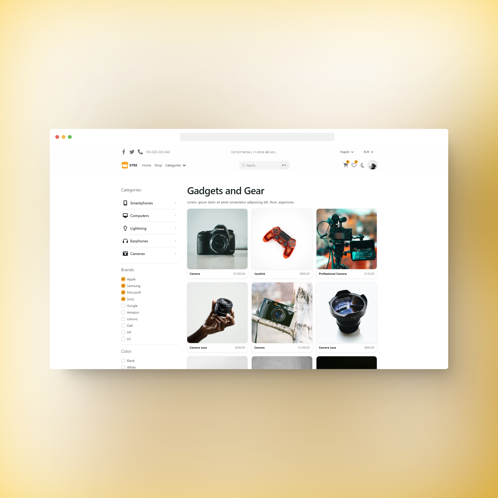
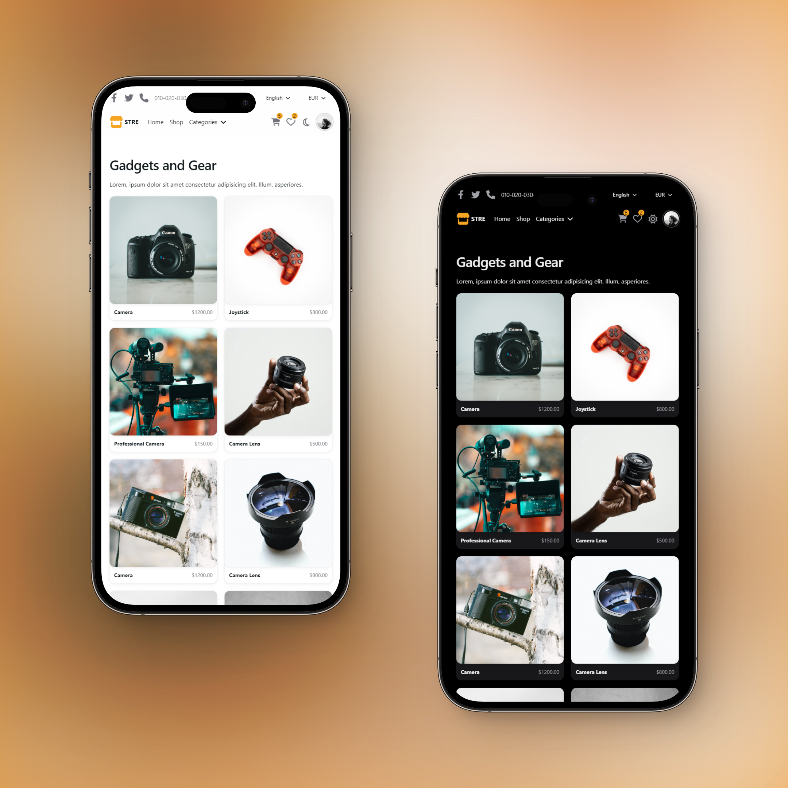

# 💻 Next.js & NextUI Template

This is a template for creating applications using Next.js 13 (app directory) and NextUI (v2).

## 🧩 Technologies Used

- [Next.js 13](https://nextjs.org/docs/getting-started)
- [NextUI v2](https://nextui.org/)
- [Tailwind CSS](https://tailwindcss.com/)
- [Tailwind Variants](https://tailwind-variants.org)
- [TypeScript](https://www.typescriptlang.org/)
- [Framer Motion](https://www.framer.com/motion/)
- [next-themes](https://github.com/pacocoursey/next-themes)

## ⌨ How to Use


### Use the template with create-next-app

To create a new project based on this template using `create-next-app`, run the following command:

```bash
npx create-next-app -e https://github.com/nextui-org/next-app-template
```

### Install dependencies

```bash
npm install
```

### Run the development server

```bash
npm run dev
```

## 📄 License

Licensed under the [MIT license](https://github.com/nextui-org/next-app-template/blob/main/LICENSE).

## 📷 Preview

|  |  |  |
| :----------------------------------: | :----------------------------------: | :----------------------------------: |
|    [Light Mode](https://github.com/SantiiD/SaleItem)    |    [Dark Mode](https://github.com/SantiiD/SaleItem)    |    [Mobile](https://github.com/SantiiD/SaleItem)    |

## 🤝 Support

<div align="center">

  [](https://ko-fi.com/SantiiD)
  [](https://patreon.com/user?u=80736594)

</div>

## 📄 Additional Information

<div align="center">

If you find this project useful, please consider giving it a ⭐️ on GitHub and sharing it.

**Last edited:** September 24, 2023

© 2023 Santi Díaz

</div>